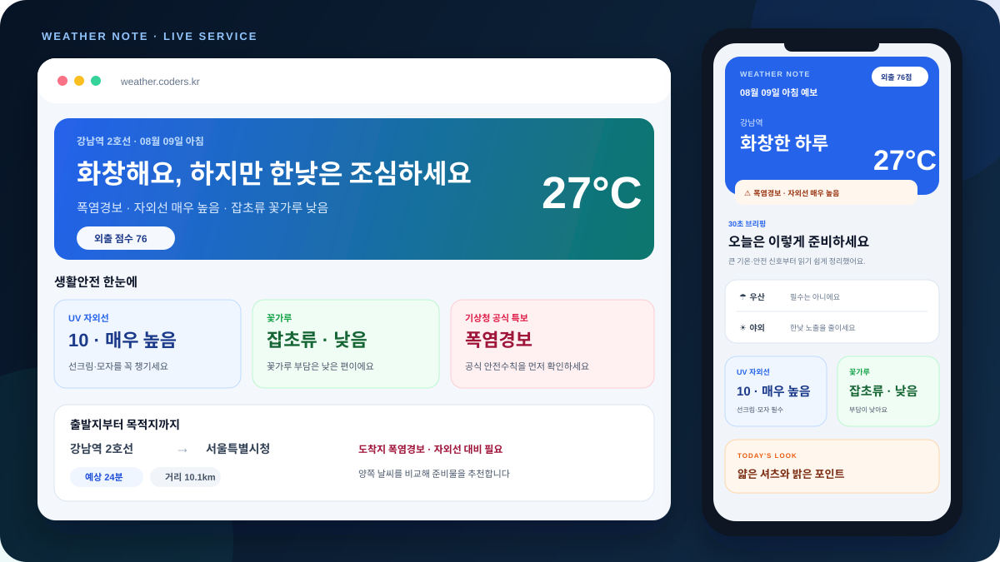
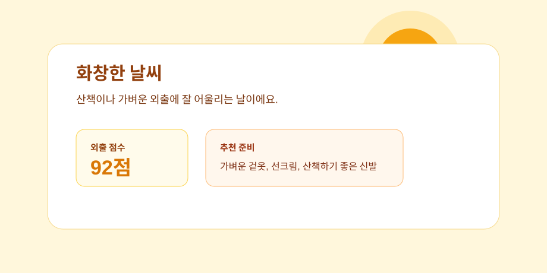
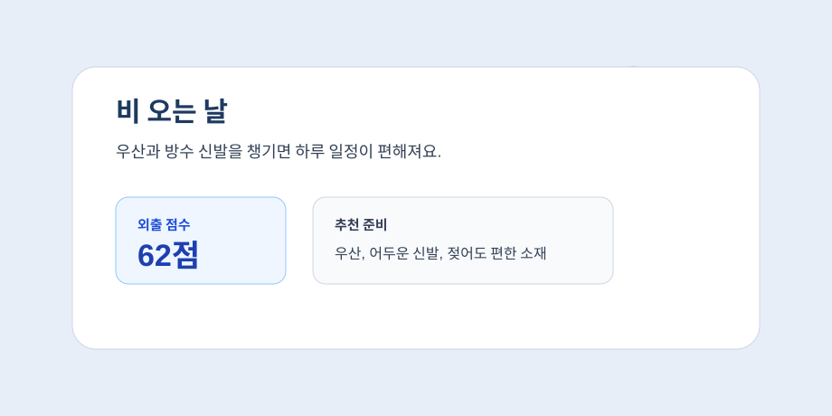
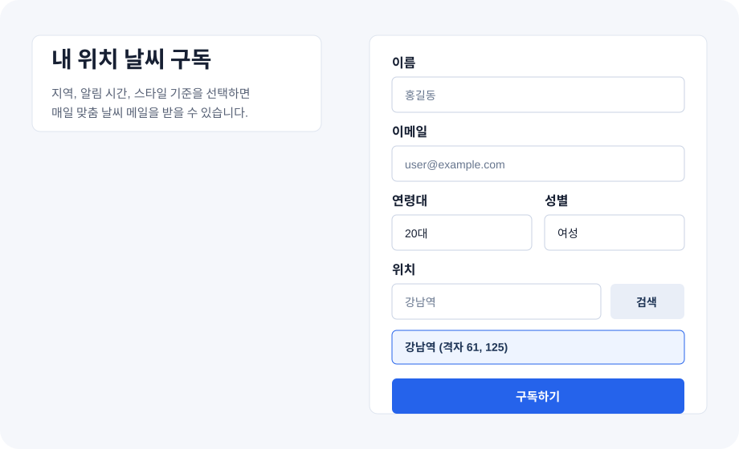
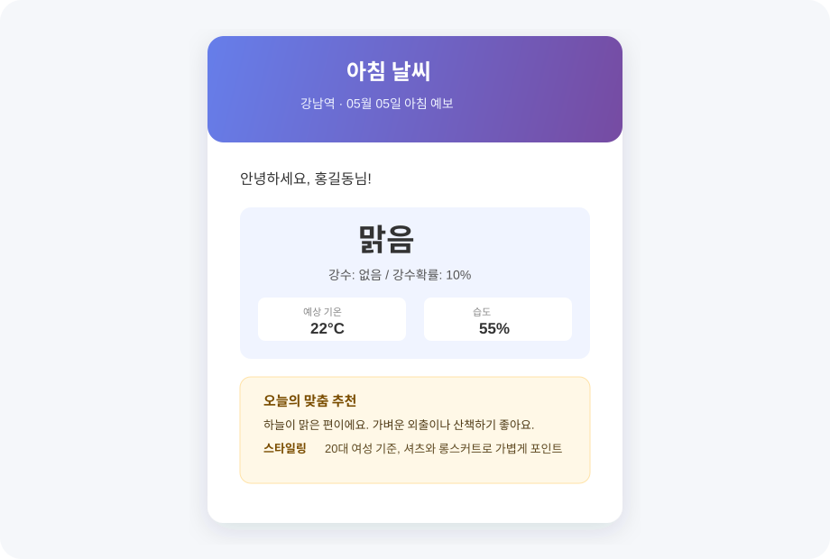
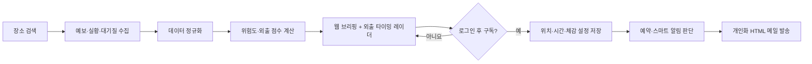
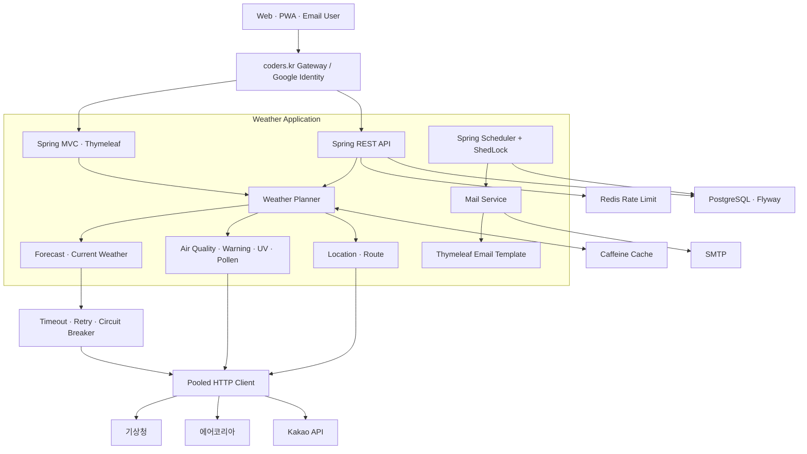

<p align="center">
  <a href="https://weather.coders.kr">
    
  </a>
</p>

<h1 align="center">날씨한편</h1>

<p align="center">
  흩어진 기상 데이터를 <strong>오늘의 행동 기준</strong>으로 바꾸고,<br>
  필요한 시간에 개인화된 날씨 브리핑을 보내는 생활 날씨 서비스
</p>

<p align="center">
  <a href="https://weather.coders.kr"></a>
  <a href="https://github.com/boclair98/Weather/actions/workflows/ci.yml"></a>
  
  
</p>

> 기상청·한국환경공단 에어코리아 원천자료를 활용하는 독립 서비스입니다. 기상청 공식 홈페이지나 인증·납품 제품을 의미하지 않습니다.

## 프로젝트 소개

날씨 정보는 많지만 사용자가 실제로 궁금한 것은 대개 단순합니다.

- 지금 우산이나 겉옷이 필요한가?
- 외출하기 좋은 시간은 언제인가?
- 미세먼지·자외선·특보까지 함께 보면 안전한가?
- 매번 앱을 열지 않고 필요한 시간에 받을 수 있는가?

날씨한편은 기상청 예보·실황, 에어코리아 대기질, 생활기상지수와 장소 정보를 한 흐름으로 정규화합니다. 이후 사용자의 위치·활동 목적·체감 성향을 반영해 **근거가 보이는 외출 판단과 HTML 이메일 브리핑**을 제공합니다.

### 프로젝트 목표

1. 여러 기관의 원천자료를 사용자가 이해하기 쉬운 하나의 브리핑으로 통합합니다.
2. 추천 결과뿐 아니라 점수에 영향을 준 수치와 행동 근거를 함께 제공합니다.
3. 외부 API 일부가 느리거나 실패해도 전체 서비스를 가능한 범위에서 계속 제공합니다.
4. 로그인 계정 단위로 구독 소유권을 보호하고 개인정보 삭제 경로를 제공합니다.
5. 다중 인스턴스 배포, 예약 발송, 요청 급증을 고려한 운영 구조를 만듭니다.

## 제품 기획: 정보가 아니라 오늘의 결정을 전달합니다

### 한 줄 가치 제안

> **10초 안에 “지금 나가도 되는지, 무엇을 챙길지, 언제 받으면 좋은지”를 결정하게 합니다.**

날씨한편의 핵심 화면은 기온을 나열하는 대시보드가 아니라 `TODAY'S CALL`이라는 하나의 행동 카드입니다. 기상청 예보·실황과 대기질·생활안전 신호를 정규화한 뒤, 사용자의 활동 목적에 따라 외출 점수·추천 시간창·준비물을 같은 언어로 보여줍니다.

### 핵심 사용 루프

| 단계 | 사용자가 보는 것 | 제품 원칙 |
| --- | --- | --- |
| 1. 장소 | 동네·역·건물 검색, 현재 위치, 최근 장소 | 검색 결과가 여러 개면 자동 선택하지 않고 정확한 장소를 직접 고르게 합니다. |
| 2. 기준 | `출근`·`산책`·`약속`·`일상` 빠른 버튼 | 한 번 탭한 기준을 로컬에 기억하고 외출 점수와 옷차림을 즉시 다시 계산합니다. |
| 3. 판단 | 외출 점수, `TODAY'S CALL`, 가장 좋은 연속 시간창 | 숫자보다 행동 문장을 먼저 보여주고, 감점 요인과 원천자료를 펼쳐서 확인할 수 있습니다. |
| 4. 알림 | 로그인 → 본인 이메일로 6자리 인증번호 받기 → 번호 입력 → 시간 선택 | 로그인하지 않은 사용자는 날씨를 둘러볼 수 있지만, 구독 버튼은 로그인으로 자연스럽게 이어집니다. |
| 5. 반복 사용 | 이메일 브리핑, 스마트 위험 알림, 해지·삭제 | 같은 위험을 중복 발송하지 않고, 계정 관리에서 언제든 설정을 바꿀 수 있습니다. |

### UX 가드레일

- 첫 화면은 검색과 오늘의 판단에 집중하고, 경로·3일 플래너·상세 안전정보는 필요할 때만 펼칩니다.
- 장소를 잘못 고르는 실수를 막기 위해 Kakao 검색 결과에는 장소명과 행정/도로명 맥락을 함께 표시합니다.
- 구독은 `Coders/Google 로그인`과 이메일 소유권 인증을 모두 통과해야 하며, 메일로 받은 6자리 번호가 맞을 때만 인증된 주소로 전송합니다.
- API 오류는 `Failed to fetch` 같은 브라우저 문구 대신 사용자가 다음에 할 행동(재시도·위치 재선택·로그인)을 안내합니다.
- 첫 화면의 라이브 날씨 카드는 선택한 지역의 실제 기온·체감온도·강수·바람을 즉시 보여주며, 맑음·흐림·비·눈에 따라 하늘 색과 그래픽이 자동으로 달라집니다.
- 모바일은 390px 폭에서도 가로 스크롤 없이 사용할 수 있으며, 날씨 카드가 설명보다 먼저 보이고 하단 고정 메뉴에서 `검색·오늘·구독`으로 바로 이동합니다. 데스크톱에서는 읽기 폭을 제한해 시선 이동을 줄입니다.
- 시간별 예보는 가장 가까운 12시간을 먼저 보여주고 전체 예보는 사용자가 요청할 때 펼쳐, 첫 화면의 정보 밀도와 DOM 렌더링 비용을 함께 줄입니다.

### 운영 품질 기준

기능을 많이 넣는 것보다 신뢰 가능한 판단을 빠르게 제공하는 것을 우선합니다. 그래서 외부 API별 timeout·retry·circuit breaker, 캐시·요청 제한, ShedLock 기반 중복 발송 방지, 데이터 신선도 라벨, 요청 추적 ID를 함께 운영합니다. 운영 배포 전 `clean test bootJar`와 실제 도메인 HTTP 200·브라우저 렌더링을 확인합니다.

## 주요 기능

| 영역 | 제공 기능 |
| --- | --- |
| 위치 검색 | 동네·역·건물 검색, 현재 위치, 최근·즐겨찾기 장소 |
| 빠른 맞춤 기준 | 출근·산책·약속·일상 버튼으로 활동 기준을 한 번에 변경 |
| 현재 날씨 | 관측 기온·체감온도·습도·바람·강수량과 관측시각 |
| 시간별 예보 | 오늘부터 모레까지 기온·강수·습도·풍속, 비 시작·종료 예상, 가까운 12시간 우선 보기 |
| 외출 타이밍 레이더 | 시간별 강수·바람·기온을 비교해 가장 부담이 적은 연속 외출 시간창과 점수를 추천 |
| 생활 안전 | PM10·PM2.5, 자외선, 꽃가루, 공식 기상특보 |
| 설명 가능한 판단 | 외출 점수, 위험 요인별 감점, 실제 근거 수치와 행동 제안, `TODAY'S CALL` 한 줄 결정 |
| 개인화 | 추위·더위 민감도, 일상·출근·야외·격식 활동별 판단과 옷차림 |
| 이동·일정 | 출발지·목적지 날씨 비교, 비·바람이 덜한 시간, 캘린더 저장 |
| 날씨 이메일 | 사용자 본인 이메일 1개, 15분 유효 6자리 인증번호(오입력 5회 제한), 사용자 지정 시각(분 단위) 예약 발송, 스마트 위험 알림 |
| 구독 관리 | Google 로그인 계정(UUID) 귀속, 인증 이메일 1개만 연결, 알림 시각 변경, 해지, 개인정보 완전 삭제 |
| 웹 경험 | 날씨 상태별 라이브 하늘 카드, 토스형 반응형 UI, 모바일 하단 빠른 메뉴, 메일과 동일한 결정 카드, 다크 모드, PWA 설치, 오프라인 상태 안내 |

## 서비스 화면

### 날씨에 따라 달라지는 화면

<table>
  <tr>
    <td width="50%"></td>
    <td width="50%"></td>
  </tr>
  <tr>
    <td align="center">맑음</td>
    <td align="center">비</td>
  </tr>
</table>

### 구독 화면과 이메일 브리핑

<table>
  <tr>
    <td width="50%"></td>
    <td width="50%"></td>
  </tr>
  <tr>
    <td align="center">계정 기반 구독 설정</td>
    <td align="center">모바일 이메일 브리핑</td>
  </tr>
</table>

## 사용자 흐름



## 시스템 아키텍처



## 핵심 기술 설계와 해결한 문제

### 1. 외부 API 장애가 전체 날씨 조회로 번지는 문제

**문제**

기상청·에어코리아·Kakao처럼 응답 특성이 다른 외부 API를 한 요청에서 사용하면, 한 공급자의 지연이 전체 응답 지연과 스레드 고갈로 이어질 수 있습니다.

**선택과 구현**

- 공급자 호출을 bounded executor에 격리하고 시도별 제한시간을 적용했습니다.
- 실패한 호출은 120ms backoff 후 한 번만 재시도합니다.
- 연속 3회 실패하면 해당 공급자의 회로를 30초간 열어 불필요한 대기를 줄입니다.
- 예보·실황은 최대 2시간 이내의 마지막 정상자료만 `STALE_FALLBACK`으로 명시해 제공합니다.
- 부가 안전정보가 실패해도 핵심 날씨 응답은 가능한 범위에서 계속 구성합니다.

**결과**

외부 장애를 정상 데이터처럼 숨기지 않으면서도, 일부 공급자의 실패가 서비스 전체 실패로 번지는 범위를 줄였습니다.

### 2. 서로 다른 데이터의 시각과 품질을 설명하기 어려운 문제

**문제**

예보 발표시각, 실제 관측시각, 서버 수집시각이 서로 다른데 이를 구분하지 않으면 사용자는 오래된 값을 최신 정보로 오해할 수 있습니다.

**선택과 구현**

- 응답에 출처·발표시각·수집시각·완전성·fallback 여부를 포함했습니다.
- 기관 연계 API는 `X-Data-Freshness`, `X-Data-Quality`, `X-Schema-Version`, `X-Request-Id` 헤더를 제공합니다.
- 위험 요인은 코드·심각도·점수 영향·근거·행동으로 분리해 영향도 순으로 전달합니다.

**결과**

화면과 API 소비자가 추천 문구뿐 아니라 데이터 상태와 판단 근거를 함께 확인할 수 있습니다.

### 3. 서버가 여러 대일 때 예약 메일이 중복 발송되는 문제

**문제**

모든 인스턴스에서 같은 스케줄러가 실행되면 동일 시간대 메일이 중복 발송될 수 있고, 위험 알림은 같은 상황을 반복해서 보낼 수 있습니다.

**선택과 구현**

- ShedLock과 데이터베이스 시간을 사용해 사용자 지정 시각을 확인하는 작업을 인스턴스 중 하나만 수행하도록 했습니다.
- 예약 작업은 매분 실행되지만 해당 분에 발송할 사용자만 복합 인덱스로 조회하고, 사용자별 날짜 슬롯 claim으로 중복 발송을 방지합니다.
- 기존 아침 06:30·점심 11:30·저녁 18:30 기본값은 마이그레이션에서 보존해 기존 구독자의 동작을 바꾸지 않습니다.
- 스마트 알림은 날짜·시간대·위험 조합 fingerprint를 저장해 같은 위험의 반복 발송을 줄였습니다.
- 메일 성공·실패 결과는 별도 트랜잭션으로 이력에 기록해 발송 작업 실패와 이력 저장을 분리했습니다.
- 실제 SMTP 전송은 bounded 비동기 executor로 처리합니다.

**결과**

다중 인스턴스 환경의 예약 작업 충돌을 줄이고, 수신자가 같은 위험 메일을 반복해서 받는 상황을 완화했습니다.

### 4. 트래픽 증가가 외부 연동과 서버 자원을 고갈시키는 문제

**문제**

날씨가 급변하거나 특보가 발표되면 같은 지역 조회가 몰리고, 외부 API 연결과 애플리케이션 스레드가 동시에 소진될 수 있습니다.

**선택과 구현**

- Caffeine 캐시에 최대 크기와 만료시간을 설정해 동일 위치의 중복 계산을 줄였습니다.
- Apache HttpClient connection pool을 전체 200개, 공급자 경로별 50개로 제한했습니다.
- 읽기·쓰기 요청 제한을 분리하고 운영에서는 Redis로 인스턴스 간 카운터를 공유합니다.
- Redis가 300ms 안에 응답하지 않으면 bounded 로컬 제한기로 전환해 요청 경로에서 격리합니다.
- 메일·외부 API·플래너 작업은 각각 용량이 제한된 executor로 분리했습니다.

**결과**

외부 시스템이나 보조 인프라가 느려질 때 애플리케이션 자원이 무제한으로 대기하지 않도록 경계를 만들었습니다.

### 5. 로그인 계정과 이메일을 안전하게 연결하는 문제

**문제**

이메일 주소만으로 구독을 만들거나 수정하면 임의의 주소를 입력하거나 타인의 구독을 변경할 수 있습니다. 또한 Coders 인증 게이트웨이는 애플리케이션에 계정별 pairwise UUID를 제공하지만 원문 Google 이메일 주소를 노출하지 않습니다.

**선택과 구현**

- 운영 환경에서는 검증된 `X-Coders-User`가 없으면 구독·관리 API를 거부합니다.
- 로그인한 UUID를 `ownerId`로 저장하고 소유권이 다른 계정의 변경을 차단합니다.
- 구독 전 15분 유효 이메일 인증 챌린지를 발급하고, 메일로 보낸 6자리 번호를 입력해 일치할 때만 해당 `ownerId`에 일회성으로 연결합니다. 새 번호를 요청하면 이전 번호는 즉시 폐기되고, 5회 틀리면 해당 챌린지를 잠급니다. 재전송은 30초 쿨다운과 API `429 Retry-After`로 남용을 막습니다.
- 구독 요청의 이메일과 인증 챌린지의 이메일이 다르면 서버에서 거부하며, 인증번호는 SHA-256 해시로만 저장하고 구독에 사용한 즉시 폐기합니다.
- 이메일로 구독을 해지하는 공개 UI는 제공하지 않습니다. 로그인 후 계정 관리 영역에서만 해지·삭제할 수 있습니다.
- 개인정보 동의 버전과 동의시각, 구독 해지시각을 저장합니다.
- 로그인 사용자는 구독과 메일 발송 이력을 함께 완전 삭제할 수 있습니다.
- 원문 이메일 대신 내부 사용자 ID를 운영 로그에 남깁니다.

**결과**

공개 날씨 조회와 개인 구독 관리를 분리하고, 계정 UUID·이메일 소유권 인증·단일 연결 정책을 함께 적용했습니다.

## 기술 스택

| 영역 | 기술과 선택 이유 |
| --- | --- |
| Language | Java 17 |
| Backend | Spring Boot 3.5.16, Spring MVC, Validation |
| View | Thymeleaf, HTML, CSS, Vanilla JavaScript |
| Persistence | Spring Data JPA, PostgreSQL, Flyway · 로컬 H2 · MySQL 드라이버 |
| Cache | Caffeine, Redis |
| Scheduling | Spring Scheduler, ShedLock |
| Integration | Apache HttpClient 5, 기상청·에어코리아·Kakao·SMTP |
| Observability | Actuator, Micrometer, Prometheus, request ID |
| Test | JUnit 5, AssertJ, Mockito, Spring Boot Test |
| Delivery | Docker, GitHub Actions, dependency review, CycloneDX SBOM |

## 주요 API

| Method | Endpoint | 설명 |
| --- | --- | --- |
| `GET` | `/api/weather/current` | 현재 관측 날씨 |
| `GET` | `/api/weather/daily` | 시간대별 개인화 날씨 |
| `GET` | `/api/weather/planner` | 일정 주변의 추천 시간대 |
| `GET` | `/api/v1/weather/briefing` | 버전 고정 기관 연계 브리핑 |
| `GET` | `/api/locations/search` | 장소 검색 |
| `GET` | `/api/routes/briefing` | 출발지·목적지 날씨 비교 |
| `POST` | `/api/users/email-verification/request` | 로그인 계정에 연결할 이메일 인증 메일 요청 |
| `POST` | `/api/users/email-verification/confirm` | 메일로 받은 6자리 인증번호 대조(일치할 때 승인) |
| `GET` | `/api/users/email-verification/confirm` | 구버전 링크 메일 호환용(새 메일은 인증번호 방식) |
| `POST` | `/api/users/subscribe` | 로그인 계정에 날씨 구독 연결 |
| `GET` | `/api/users/me` | 현재 계정의 구독 조회 |
| `PATCH` | `/api/users/me/notifications` | 알림 여부와 한국 시간 기준 분 단위 발송 시각 변경 |
| `DELETE` | `/api/users/me/data` | 구독과 개인정보 완전 삭제 |

`/api/users/subscribe`는 운영 환경에서 `X-Coders-User`와 이메일 인증번호(`verificationCode`)를 모두 요구하며, 인증된 이메일 하나만 받습니다. 이전 링크 인증 클라이언트의 `verificationToken`도 호환성을 위해 당분간 허용합니다. 인증번호 재전송을 30초 안에 다시 요청하면 `429 VERIFICATION_COOLDOWN`과 `Retry-After`가 반환됩니다. `/api/users/me/notifications`의 알림 시각 필드는 `HH:mm` 형식의 `morningTime`, `afternoonTime`, `eveningTime`입니다. 운영 스케줄러는 매분 해당 시각의 사용자만 조회하고, 한국 표준시(`Asia/Seoul`)로 발송합니다.
오류 응답은 `application/problem+json`과 요청 추적 ID를 사용합니다. 상세 계약은 [API 계약](docs/API_CONTRACT.md)에서 확인할 수 있습니다.

## 프로젝트 구조

```text
src/main
├── java/com/example/WebSideProject
│   ├── config       # 보안 헤더, 요청 제한, HTTP client, cache, scheduler lock
│   ├── controller   # 웹·날씨·위치·경로·구독·기관 API
│   ├── dto          # 외부 응답과 공개 API 계약
│   ├── entity       # 구독 사용자와 메일 발송 이력
│   ├── event        # 구독 직후 비동기 메일 이벤트
│   ├── repository   # JPA repository
│   ├── scheduler    # 정기 브리핑과 스마트 위험 알림
│   └── service      # 날씨 수집·정규화·판단·메일 발송
└── resources
    ├── db/migration # PostgreSQL Flyway migration
    ├── static       # PWA manifest, service worker, favicon
    └── templates    # 반응형 웹 UI와 HTML 메일
```

## 테스트와 배포 품질

Pull Request와 `main` push에서 다음 검사를 자동 수행합니다.

- Gradle wrapper 검증
- 단위·통합 테스트와 실행 JAR 생성
- 운영 Docker 이미지 빌드
- 새 의존성의 고위험 취약점 검사
- 컨테이너 CycloneDX SBOM 생성

운영 상태는 liveness·readiness probe, Actuator, Prometheus 지표로 확인합니다. 상세 장애 대응과 롤백 절차는 [운영 런북](docs/OPERATIONS.md)에 기록했습니다.

## 로컬 실행

### 요구사항

- Java 17
- 전체 기능 사용 시 기상청·에어코리아·Kakao API 키와 SMTP 계정
- 운영 구성 사용 시 PostgreSQL과 Redis

```powershell
git clone https://github.com/boclair98/Weather.git
cd Weather
.\gradlew.bat clean test bootJar --no-daemon
.\gradlew.bat bootRun
```

기본 개발 환경은 인메모리 H2를 사용합니다. 외부 API 키는 저장소에 커밋하지 않고 환경변수로 주입하며, 전체 목록은 [.env.example](.env.example)을 참고하세요.

## 운영 문서

- [API 계약](docs/API_CONTRACT.md)
- [운영 런북](docs/OPERATIONS.md)
- [개인정보 처리 설계](docs/PRIVACY.md)
- [기관 도입 준비 범위](docs/PUBLIC_SECTOR_READINESS.md)
- [제품 로드맵](docs/PRODUCT_ROADMAP.md)
- [보안 정책](SECURITY.md)
- [기여 방법](CONTRIBUTING.md)

## 현재 범위와 한계

- 예보와 관측은 원천기관의 갱신 주기·정확도·호출 제한에 영향을 받습니다.
- 위험 상황에서는 서비스 추천보다 기상청 공식 특보와 관계기관 지침을 우선해야 합니다.
- 현재 계정 인증은 운영 플랫폼의 Google 로그인을 사용합니다. 플랫폼은 앱에 원문 이메일 대신 프로젝트별 UUID만 전달하므로, 첫 구독에는 15분 유효 6자리 이메일 인증번호 입력이 필요합니다. Naver·Kakao 로그인은 공급자가 신뢰 가능한 이메일 claim을 제공하는지 확인한 뒤 추가할 예정입니다.
- 성능 관련 항목은 자원 고갈을 막기 위한 구조적 경계이며, 공개된 대규모 부하 시험 수치를 의미하지 않습니다.

---

<p align="center">
  <strong>날씨한편은 날씨를 보여주는 데서 끝나지 않고, 사용자가 오늘 무엇을 할지 결정하도록 돕습니다.</strong>
</p>
