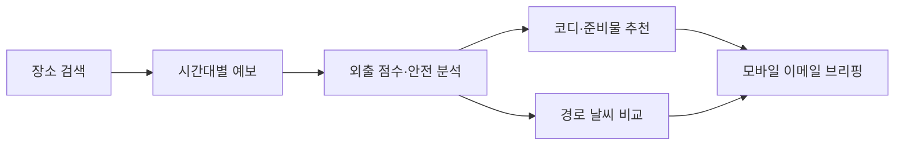
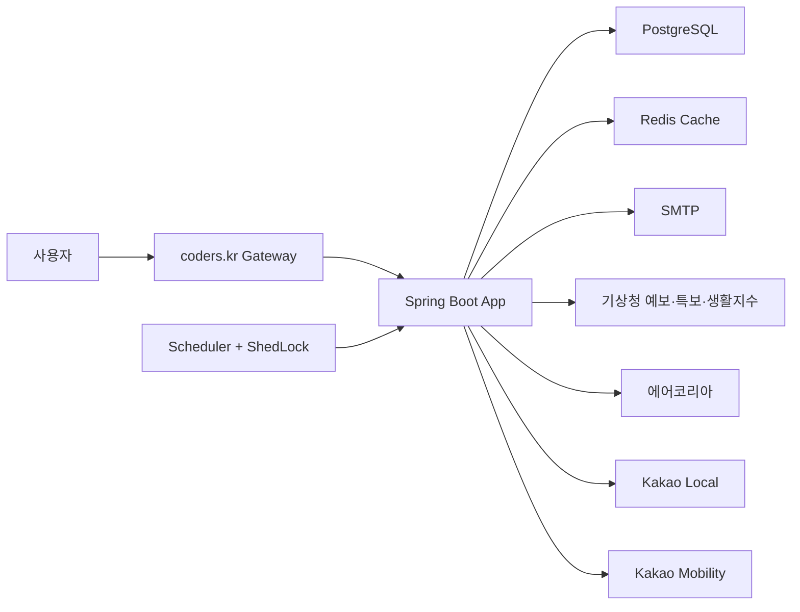

<p align="center">
  
</p>

<h1 align="center">날씨한편</h1>

<p align="center">
  기온을 보여주는 데서 멈추지 않고<br>
  <strong>오늘 나가도 되는지, 무엇을 챙길지, 목적지에서는 어떤지</strong> 알려주는 생활 날씨 브리핑
</p>

<p align="center">
  <a href="https://weather.coders.kr"></a>
  <a href="https://github.com/boclair98/Weather/actions/workflows/ci.yml"></a>
  
  
</p>

> **운영 중:** [https://weather.coders.kr](https://weather.coders.kr)

## 서비스 소개

날씨한편은 위치별 예보, 기상특보, 자외선, 꽃가루, 대기질을 한 번에 분석해 사용자의 행동으로 번역합니다. 사용자는 웹에서 지금의 외출 조건과 코디를 확인하고, 원하는 시간에 같은 내용을 모바일 친화적인 이메일로 받을 수 있습니다.

단순한 “오늘 27°C” 대신 다음 질문에 답하는 서비스입니다.

- 우산이나 마스크를 챙겨야 할까?
- 오늘 중 언제 나가는 게 가장 좋을까?
- 추위를 많이 타는 사람은 무엇을 입어야 할까?
- 목적지 날씨가 출발지와 얼마나 다를까?
- 공식 특보나 강한 자외선이 있는가?

## 핵심 경험

| 단계 | 사용자가 얻는 결과 |
| --- | --- |
| 위치 선택 | 동네·역·건물명 검색, 현재 위치, 최근 장소 바로가기 |
| 외출 판단 | 오늘·내일·모레 비교, 시간대별 외출 점수, 강수·대기질·안전 신호 |
| 맞춤 준비 | 우산·마스크·야외활동 조언, 체감·일정 기반 동적 코디 |
| 일정 계획 | 3일 중 가장 좋은 날·시간 추천, 통합 준비물, 캘린더 저장 |
| 경로 분석 | 출발지→목적지 거리·시간, 양쪽 날씨, 도착 준비 체크리스트 |
| 알림 구독 | 아침·점심·저녁 선택 발송, 최대 10개 이메일, 스마트 위험 알림 |



## 주요 기능

### 1. 오늘·내일·모레 행동형 날씨 대시보드

- 아침·점심·저녁 기온, 강수확률과 외출 점수 비교
- 하루 중 가장 나가기 좋은 시간대 추천
- 우산, 마스크, 야외활동 준비를 행동 문장으로 제공
- 날씨에 따라 맑음·비·눈·흐림 테마 자동 전환
- 최근 본 장소 5개를 브라우저에 저장

### 2. 3일 결정 플래너

세 날짜의 예보를 따로 열어 비교할 필요 없이 “언제 움직일지”를 한 화면에서 정할 수 있습니다.

- 오늘·내일·모레의 시간대 평균 외출 점수와 최고 시간 비교
- 3일 중 가장 좋은 날짜와 아침·점심·저녁 추천
- 단기예보의 비·눈, 기온, 바람을 우선순위에 따라 행동으로 변환하고 상세 안전정보는 선택 날짜 카드에서 제공
- 3일 동안 필요한 준비물을 중복 없이 통합
- 추천 외출 시간을 `.ics` 캘린더 일정으로 저장
- 선택 위치·날짜·시간대를 그대로 복원하는 공유 링크 생성
- 3일 API 호출을 전용 bounded executor에서 병렬 처리하고 결과를 캐시

### 3. 공식 생활안전 브리핑

- 지역별 기상특보
- 최대 자외선지수와 행동 요령
- 계절성 꽃가루 위험지수
- 미세먼지·초미세먼지와 마스크 안내
- 안전 신호를 외출 점수, 코디, 이메일, 스마트 알림에 함께 반영

### 4. 출발지→목적지 경로 날씨

카카오모빌리티 길찾기 결과와 양쪽 날씨를 결합해 이동 전에 확인할 정보를 한 번에 제공합니다.

- 자동차 예상 거리와 시간
- 출발지·목적지 기온과 외출 점수 비교
- 비, 대기질, 자외선, 꽃가루, 기상특보 체크
- 두 장소의 기온 차가 큰 경우 겉옷 안내

### 5. 동적 스타일링

정적인 계절별 문구가 아니라 실제 날씨와 사용자 설정을 조합합니다.

- 체감 성향: `NONE`, `COLD`, `HEAT`
- 일정 유형: `DAILY`, `COMMUTE`, `OUTDOOR`, `FORMAL`
- 상의, 하의, 겉옷, 신발, 추천 컬러와 피해야 할 스타일
- 기온, 비·눈, 바람, 습도, 대기질을 모두 반영

### 6. 구독과 스마트 알림

- Google 로그인으로 구독 소유권 보호
- 한 계정에 최대 10개 수신 이메일 연결
- 아침 06:30, 점심 11:30, 저녁 18:30 중 선택
- 같은 이메일 재등록 시 위치·시간·스타일 설정 업데이트
- 이메일 입력 또는 메일의 토큰 링크로 구독 취소
- 비·눈, 폭염·한파, 대기질, 강풍, 공식 특보, 자외선, 꽃가루 위험 감지
- 같은 위험을 반복 발송하지 않는 fingerprint 기반 중복 방지

### 7. 설치형 웹 앱과 오프라인 안내

- 웹 앱 매니페스트와 서비스 워커를 통한 홈 화면 설치
- 정적 앱 셸 network-first 캐시와 이전 버전 자동 정리
- 오프라인일 때 저장된 화면 제공 및 명확한 연결 상태 표시
- API 오프라인 오류를 공통 JSON 형태로 반환
- 키보드 건너뛰기 링크, focus-visible, live/busy 상태, reduced-motion 접근성 지원

## 새 모바일 메일 UI

메일은 Gmail·네이버 메일에서 안정적으로 보이도록 `table`과 인라인 스타일을 중심으로 구성했습니다. 지원 편차가 큰 `grid`, `flex`, `gradient`, JavaScript는 사용하지 않습니다.

<p align="center">
  
</p>

메일을 열면 다음 순서로 정보를 읽을 수 있습니다.

1. 큰 기온과 외출 점수
2. 30초 날씨 요약과 위험 신호
3. 우산·마스크·야외활동 준비
4. 기상특보·자외선·꽃가루·대기질
5. 체감 성향과 일정에 맞춘 오늘의 코디
6. 운영 사이트 바로가기와 수신 거부

템플릿 테스트는 실제 데이터로 최종 HTML을 렌더링하고, 메일 호환성을 해치는 CSS가 다시 들어오지 않도록 검사합니다.

## 데이터 소스

| 데이터 | 사용처 | 환경변수 |
| --- | --- | --- |
| 기상청 단기예보 | 기온, 하늘, 강수, 습도, 풍속 | `WEATHER_API_KEY` |
| 기상청 기상특보 | 지역별 공식 주의·경보 | `WEATHER_WARNING_API_KEY` |
| 기상청 생활기상지수 | 자외선지수 | `LIVING_WEATHER_API_KEY` |
| 기상청 보건기상지수 | 계절성 꽃가루 위험 | `POLLEN_API_KEY` |
| 에어코리아 | 미세먼지·초미세먼지 | `AIR_QUALITY_API_KEY` |
| Kakao Local | 장소·주소 검색 | `KAKAO_REST_API_KEY` |
| Kakao Mobility | 자동차 경로 거리·시간 | `KAKAO_MOBILITY_REST_API_KEY` |
| SMTP | 브리핑·위험 알림 발송 | `SMTP_USERNAME`, `SMTP_PASSWORD` |

안전정보나 대기질처럼 보조 데이터가 일시적으로 실패해도 기본 날씨 조회는 유지되도록 구성했습니다.

## 기술 스택

| 영역 | 기술 |
| --- | --- |
| Backend | Java 17, Spring Boot 3.2.5, Spring Web, Validation |
| Persistence | Spring Data JPA, PostgreSQL, MySQL, H2 |
| Cache | Redis, Caffeine Cache |
| Scheduling | Spring Scheduler, ShedLock |
| Mail | Spring Mail, Thymeleaf HTML |
| HTTP | Apache HttpClient 5 |
| Operations | Actuator, Docker, coders.kr |
| Quality | JUnit 5, AssertJ, GitHub Actions, Dependabot |

## 운영 아키텍처



- 날씨 응답은 Redis/Caffeine에 캐시해 외부 API와 애플리케이션 부하를 낮춥니다.
- 공개 조회 응답은 `stale-while-revalidate`와 `stale-if-error`를 제공해 재검증 중이거나 외부 API가 잠시 실패해도 기존 정보를 활용합니다.
- 예약 작업은 DB 분산 락으로 보호해 여러 인스턴스에서도 한 번만 실행됩니다.
- 메일 작업은 bounded executor와 backpressure를 사용합니다.
- 3일 플래너는 별도 bounded executor와 Redis/Caffeine 캐시를 사용합니다.
- 읽기와 쓰기 API에 서로 다른 분당 요청 한도를 적용합니다.
- Actuator health probe, graceful shutdown, 응답 압축을 적용했습니다.
- 운영 프로필은 필수 기상청 키 누락을 health `DOWN`으로 감지해 잘못된 배포를 차단합니다.
- Actuator metrics에 3일 플래너 cold-cache 생성 시간과 성공·실패 상태를 기록합니다.

## 빠른 시작

### 요구사항

- Java 17
- 별도 DB 없이 시작 가능: 기본값은 H2 인메모리 DB
- 실제 날씨 조회에는 기상청 API 키 필요
- 메일 발송에는 Gmail 앱 비밀번호 또는 호환 SMTP 계정 필요

### 실행

```bash
./gradlew bootRun
```

Windows PowerShell:

```powershell
$env:WEATHER_API_KEY="your_kma_api_key"
$env:KAKAO_REST_API_KEY="your_kakao_rest_api_key"
$env:SMTP_USERNAME="your_email@gmail.com"
$env:SMTP_PASSWORD="your_gmail_app_password"
.\gradlew.bat bootRun
```

실행 후 [http://localhost:8080](http://localhost:8080)에서 확인합니다.

MySQL을 사용할 경우:

```sql
CREATE DATABASE weatherdb
  DEFAULT CHARACTER SET utf8mb4
  COLLATE utf8mb4_unicode_ci;
```

```powershell
$env:DB_URL="jdbc:mysql://localhost:3306/weatherdb?useSSL=false&serverTimezone=Asia/Seoul&characterEncoding=UTF-8&allowPublicKeyRetrieval=true"
$env:DB_DRIVER="com.mysql.cj.jdbc.Driver"
$env:DB_USERNAME="root"
$env:DB_PASSWORD="your_mysql_password"
.\gradlew.bat bootRun
```

## 환경변수

전체 예시는 [.env.example](.env.example)을 참고하세요. 실제 키와 비밀번호는 Git에 커밋하지 않습니다.

```env
WEATHER_API_KEY=your_kma_api_key
AIR_QUALITY_API_KEY=your_airkorea_api_key
KAKAO_REST_API_KEY=your_kakao_rest_api_key
KAKAO_MOBILITY_REST_API_KEY=your_kakao_mobility_rest_api_key
WEATHER_WARNING_API_KEY=your_kma_warning_api_key
LIVING_WEATHER_API_KEY=your_kma_living_weather_api_key
POLLEN_API_KEY=your_kma_pollen_api_key

SMTP_HOST=smtp.gmail.com
SMTP_PORT=587
SMTP_USERNAME=your_email@gmail.com
SMTP_PASSWORD=your_gmail_app_password

APP_BASE_URL=http://localhost:8080
ADMIN_API_KEY=generate_a_long_random_key
RATE_LIMIT_READ_PER_MINUTE=180
RATE_LIMIT_WRITE_PER_MINUTE=20
```

로컬 전용 값은 Git에서 제외되는 `application-local.yml`에 보관할 수도 있습니다. 운영 키는 coders.kr secret 환경변수로 등록합니다.

## API 요약

| Method | Endpoint | 설명 |
| --- | --- | --- |
| `GET` | `/api/locations/search?query=강남역` | 장소 검색과 기상청 격자 변환 |
| `GET` | `/api/locations/coordinates` | 위도·경도를 장소와 격자로 변환 |
| `GET` | `/api/weather` | 위치·시간대별 맞춤 날씨 |
| `GET` | `/api/weather/daily` | 아침·점심·저녁 일일 브리핑 |
| `GET` | `/api/weather/planner` | 오늘·내일·모레 결정 플래너와 통합 준비물 |
| `GET` | `/api/routes/briefing` | 출발지→목적지 경로 날씨 |
| `POST` | `/api/users/subscribe` | 최대 10개 이메일 구독 |
| `POST` | `/api/users/unsubscribe` | 여러 이메일 구독 취소 |
| `GET` | `/api/users/me` | 로그인 계정의 대표 구독 조회 |
| `PATCH` | `/api/users/me/notifications` | 알림 시간 변경 |
| `PATCH` | `/api/users/me/smart-alerts` | 스마트 위험 알림 변경 |
| `DELETE` | `/api/users/me/subscription` | 현재 계정 구독 취소 |

### 일일 브리핑

```http
GET /api/weather/daily?nx=61&ny=125&locationName=강남역&dayOffset=0&temperatureSensitivity=HEAT&activityType=OUTDOOR
```

### 경로 날씨

```http
GET /api/routes/briefing?originQuery=강남역&destinationQuery=서울시청&period=MORNING
```

### 3일 결정 플래너

```http
GET /api/weather/planner?nx=61&ny=125&locationName=강남역&temperatureSensitivity=COLD&activityType=COMMUTE
```

### 여러 메일함 구독

```http
POST /api/users/subscribe
Content-Type: application/json
```

```json
{
  "name": "사용자",
  "emails": ["me@example.com", "family@example.com"],
  "locationName": "강남역",
  "latitude": 37.4979,
  "longitude": 127.0276,
  "nx": 61,
  "ny": 125,
  "temperatureSensitivity": "COLD",
  "activityType": "COMMUTE",
  "smartAlertEnabled": true,
  "morningEnabled": true,
  "afternoonEnabled": false,
  "eveningEnabled": true
}
```

운영용 메일 수동 발송과 이력 조회 API는 `ADMIN_API_KEY`가 설정된 환경에서 `X-Admin-Key` 헤더가 필요합니다. 키가 없으면 운영 관리자 API는 fail-closed로 비활성화됩니다.

## 보안과 안정성

- Google 로그인과 coders native identity로 구독 소유권 확인
- 관리자 API key constant-time 비교와 fail-closed 정책
- `/actuator/metrics` 관리자 키 보호, 공개 health probe 분리
- 저장소 밖 secret 환경변수 관리
- 토큰 기반 이메일 수신 거부
- 입력 길이·이메일·좌표·격자 범위 검증
- 요청 주체별 읽기·쓰기 API rate limit과 `Retry-After` 응답
- CSP, HSTS, Permissions Policy, COOP/CORP 등 보안 응답 헤더 적용
- 외부 API 연결 풀과 연결·응답 타임아웃
- service worker 무효화 정책과 오프라인 API 오류 표준화
- 사용자 응답에서 내부 예외와 비밀값 제거
- 오류 코드와 `requestId`를 통한 운영 로그 추적
- 전 요청 `X-Request-Id` 전파와 MDC 상관관계로 필터·컨트롤러·외부 API 로그 연결
- 운영 로그에는 이메일 대신 내부 사용자 ID만 기록해 개인정보 노출 최소화

## 테스트와 CI

```bash
./gradlew clean test bootJar --no-daemon
```

현재 자동화 테스트는 DTO 계산, 3일 플래너, API 요청 제한, 사용자 식별, 예외 처리, 컨트롤러, 기상 안전 데이터 파싱, 경로 브리핑, 메일 HTML 렌더링을 포함합니다.

GitHub Actions는 모든 Pull Request에서 다음을 검증합니다.

1. Gradle Wrapper 검증
2. Java 17 전체 테스트
3. 실행 JAR 패키징
4. 프로덕션 Docker 이미지 빌드
5. 테스트 리포트 업로드

## coders.kr 배포

[`coders.yaml`](coders.yaml)은 native Spring Boot 서비스, 관리형 PostgreSQL, Redis 구성을 선언합니다.

필수 운영 secret:

```text
WEATHER_API_KEY
AIR_QUALITY_API_KEY
KAKAO_REST_API_KEY
KAKAO_MOBILITY_REST_API_KEY
WEATHER_WARNING_API_KEY
LIVING_WEATHER_API_KEY
POLLEN_API_KEY
SMTP_USERNAME
SMTP_PASSWORD
ADMIN_API_KEY
APP_BASE_URL=https://weather.coders.kr
```

coders.kr의 scale-to-zero 환경에서 예약 메일을 정확히 실행하려면 프로젝트 정책의 `always_warm` 설정과 예산 상태를 확인해야 합니다.

## 프로젝트 구조

```text
src/main/java/com/example/WebSideProject
├── config/       # 캐시, HTTP, 비동기 실행, 보안 헤더, 분산 락
├── controller/   # 위치, 날씨, 경로, 구독, 메일 API
├── dto/          # 날씨·안전·경로·사용자 응답과 계산 모델
├── entity/       # 구독 사용자, 메일 발송 이력
├── event/        # 비동기 웰컴 메일 이벤트
├── repository/   # JPA 저장소
├── scheduler/    # 정기 메일, 스마트 위험 알림
└── service/      # 외부 API, 추천, 구독, 메일 비즈니스 로직

src/main/resources
├── application.yml
├── application-prod.yml
├── static/manifest.webmanifest
├── static/service-worker.js
├── templates/index.html
└── templates/weather-mail.html
```

## 다음 개선 후보

- 주간 예보와 실제 Google Calendar 양방향 연동
- 사용자별 분 단위 발송 시간
- 운영자용 발송 성공률·API 장애 대시보드
- 메일 제목·정보 순서 A/B 테스트
- Flyway 기반 명시적 스키마 마이그레이션

---

날씨한편은 “날씨를 확인하는 서비스”보다 **외출을 결정하고 준비하는 서비스**를 지향합니다.
