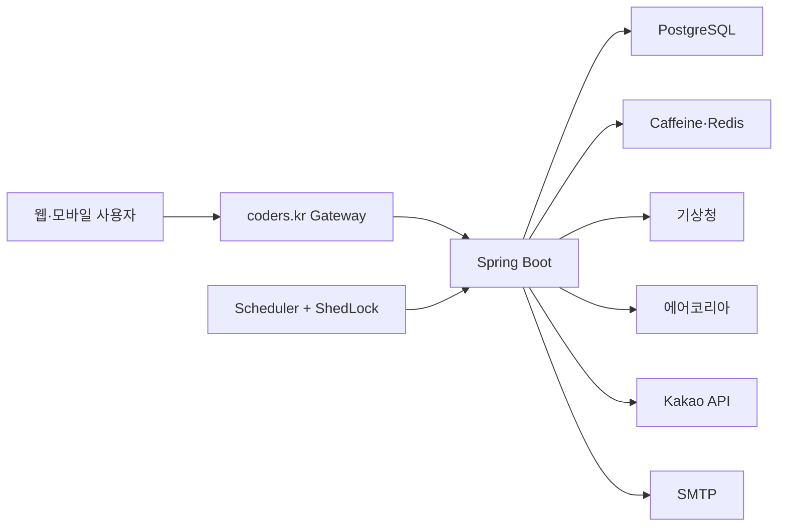

<p align="center">
  <a href="https://weather.coders.kr">
    
  </a>
</p>

<h1 align="center">날씨한편</h1>

<p align="center">
  내 위치의 <strong>시간별 날씨·강수·대기질·기상특보</strong>를 한눈에 보여주고<br>
  필요한 날씨만 이메일로 전달하는 생활 날씨 서비스
</p>

<p align="center">
  <a href="https://weather.coders.kr"></a>
  <a href="https://github.com/boclair98/Weather/actions/workflows/ci.yml"></a>
  
  
</p>

## 바로 사용하기

**운영 서비스:** [https://weather.coders.kr](https://weather.coders.kr)

1. 동네, 역 또는 건물명을 검색합니다.
2. 오늘·내일·모레와 시간별 날씨를 확인합니다.
3. 원하는 경우 여러 이메일에 아침·점심·저녁 브리핑을 구독합니다.

> 기상청·에어코리아 원천자료를 활용한 독립 서비스입니다. 기상청 공식 홈페이지나 인증·납품 제품을 의미하지 않습니다.

## 이 서비스가 알려주는 것

| 사용자의 질문 | 제공 정보 |
| --- | --- |
| 지금부터 날씨가 어떻게 변할까? | 시간별 기온, 하늘, 강수확률, 습도, 풍속 |
| 비는 언제 시작하고 끝날까? | 비·눈 가능성이 높은 첫 시간과 마지막 시간 |
| 공기는 괜찮을까? | 에어코리아 PM10·PM2.5, 등급, 측정소 |
| 위험한 날씨가 있나? | 기상특보, 자외선, 꽃가루와 행동 안내 |
| 오늘과 내일 중 언제가 좋을까? | 3일 예보와 아침·점심·저녁 비교 |
| 무엇을 준비해야 할까? | 우산, 마스크, 야외활동, 동적 코디 추천 |
| 메일로 받을 수 있나? | 최대 10개 이메일, 선택 시간, 위험 스마트 알림 |

## 핵심 기능

### 시간별·3일 날씨

- 동네·역·건물 검색과 현재 위치
- 오늘부터 모레까지 시간별 기온·강수·습도·바람
- 강수 시작·종료 예상 구간과 일 최저·최고기온
- 아침·점심·저녁 비교와 날씨 테마 자동 전환
- 기상청 발표·수집시각, 자료 완전성, fallback 여부

### 공기질과 생활안전

- 에어코리아 PM10·PM2.5, 등급, 측정소 표시
- 지역별 공식 기상특보
- 자외선지수와 계절성 꽃가루 위험
- 외부 보조 API 장애 시에도 기본 날씨는 계속 제공

### 날씨 이메일

- 한 계정에 최대 10개 수신 이메일
- 아침 06:30, 점심 11:30, 저녁 18:30 선택
- 모바일 Gmail·네이버 메일 호환 HTML
- 같은 위험의 중복 발송을 막는 fingerprint
- 이메일 입력 또는 토큰 링크를 통한 구독 취소

<p align="center">
  
</p>

### 보조 도구

- 출발지와 목적지의 날씨·이동시간 비교
- 희망 일정 주변에서 비·바람이 덜한 출발 시간 제안
- 체감 성향과 활동 목적에 맞춘 상·하의, 아우터, 신발 추천
- 추천 시간을 `.ics` 캘린더 파일로 저장
- 홈 화면 설치와 오프라인 상태 안내

## 데이터 출처

| 제공기관 | 데이터 | 환경변수 |
| --- | --- | --- |
| 기상청 | 단기예보 | `WEATHER_API_KEY` |
| 기상청 | 기상특보 | `WEATHER_WARNING_API_KEY` |
| 기상청 | 자외선 생활기상지수 | `LIVING_WEATHER_API_KEY` |
| 기상청 | 꽃가루 보건기상지수 | `POLLEN_API_KEY` |
| 한국환경공단 에어코리아 | PM10·PM2.5 실시간 정보 | `AIR_QUALITY_API_KEY` |
| Kakao Local | 장소·주소 검색 | `KAKAO_REST_API_KEY` |
| Kakao Mobility | 자동차 경로 | `KAKAO_MOBILITY_REST_API_KEY` |
| SMTP | 날씨 브리핑 발송 | `SMTP_USERNAME`, `SMTP_PASSWORD` |

공공데이터포털의 Encoding/Decoding 인증키를 모두 처리하며, 비밀값은 저장소가 아닌 환경변수로 관리합니다.

## 기술 구성

| 영역 | 기술 |
| --- | --- |
| Backend | Java 17, Spring Boot 3.5.16, Spring Web, Validation |
| UI | Thymeleaf, HTML, CSS, Vanilla JavaScript, PWA |
| Database | PostgreSQL 운영, MySQL 선택, H2 로컬 기본값 |
| Cache | Caffeine, Redis |
| Scheduling | Spring Scheduler, ShedLock |
| Mail | Spring Mail, Thymeleaf HTML |
| Operations | Docker, coders.kr, Actuator, Prometheus |
| Quality | JUnit 5, AssertJ, GitHub Actions, Dependabot |



## 운영 안정성

- 외부 API 연결·응답 timeout, 1회 재시도, circuit breaker
- 기상청 장애 시 2시간 이내 마지막 정상자료 fallback
- bounded Caffeine 캐시와 Redis 분산 요청 제한
- 공개 응답의 `stale-while-revalidate`, `stale-if-error`
- DB 분산 락으로 다중 인스턴스 예약메일 중복 방지
- bounded 메일 executor와 backpressure
- Flyway 스키마 버전 관리, readiness/liveness probe
- CSP nonce, HSTS, 입력 검증, 관리자 API fail-closed
- request ID·Prometheus·SBOM·dependency review

상세 운영 자료: [운영 런북](docs/OPERATIONS.md) · [API 계약](docs/API_CONTRACT.md) · [개인정보 설계](docs/PRIVACY.md) · [공공기관 도입 준비도](docs/PUBLIC_SECTOR_READINESS.md) · [보안 정책](SECURITY.md)

## 로컬 실행

### 요구사항

- Java 17
- 기본 실행은 별도 DB가 필요 없는 H2 사용
- 실제 외부 데이터를 사용하려면 해당 API 키 필요

```powershell
$env:WEATHER_API_KEY="your_kma_api_key"
$env:AIR_QUALITY_API_KEY="your_airkorea_api_key"
$env:KAKAO_REST_API_KEY="your_kakao_api_key"
$env:SMTP_USERNAME="your_email@gmail.com"
$env:SMTP_PASSWORD="your_app_password"
.\gradlew.bat bootRun
```

실행 후 [http://localhost:8080](http://localhost:8080)에서 확인합니다. 전체 환경변수는 [.env.example](.env.example)을 참고하세요. 실제 키와 비밀번호는 커밋하지 않습니다.

### 테스트

```powershell
.\gradlew.bat clean test bootJar --no-daemon
```

CI는 Gradle Wrapper, 전체 테스트, 실행 JAR, Docker 이미지, 의존성 취약점과 CycloneDX SBOM을 검증합니다.

## 주요 API

| Method | Endpoint | 설명 |
| --- | --- | --- |
| `GET` | `/api/locations/search?query=강남역` | 장소 검색과 기상청 격자 변환 |
| `GET` | `/api/weather/daily` | 아침·점심·저녁 일일 날씨 |
| `GET` | `/api/weather/hourly` | 날짜별 시간 예보 |
| `GET` | `/api/weather/planner` | 오늘·내일·모레 비교 |
| `GET` | `/api/weather/decision-window` | 일정 주변 날씨 비교 보조 기능 |
| `GET` | `/api/routes/briefing` | 출발지→목적지 경로 날씨 |
| `POST` | `/api/users/subscribe` | 최대 10개 이메일 구독 |
| `POST` | `/api/users/unsubscribe` | 이메일 구독 취소 |
| `PATCH` | `/api/users/me/notifications` | 알림 시간 변경 |
| `PATCH` | `/api/users/me/smart-alerts` | 위험 알림 설정 |
| `DELETE` | `/api/users/me/data` | 구독과 개인정보 삭제 |

관리자 메일 API는 `ADMIN_API_KEY`와 `X-Admin-Key`가 필요하며 운영에서 fail-closed로 동작합니다.

## 프로젝트 구조

```text
src/main/java/com/example/WebSideProject
├── config/       캐시, 비동기 실행, 보안, 분산 락
├── controller/   위치, 날씨, 경로, 구독, 메일 API
├── dto/          날씨·안전·경로 응답과 계산 모델
├── entity/       구독 사용자와 메일 이력
├── repository/   JPA 저장소
├── scheduler/    정기 브리핑과 스마트 알림
└── service/      외부 API와 비즈니스 로직

src/main/resources
├── application.yml
├── application-prod.yml
├── static/
└── templates/
```

## 배포

[`coders.yaml`](coders.yaml)은 Spring Boot 애플리케이션, 관리형 PostgreSQL, Redis를 선언합니다. 운영 비밀값은 coders.kr Secret으로 저장한 뒤 재배포합니다.

scale-to-zero 환경에서 예약메일을 항상 정확하게 실행하려면 프로젝트의 `always_warm` 정책과 예산 상태를 별도로 확인해야 합니다.

---

**날씨한편은 날씨 정보가 중심이고, 추천 기능은 그 정보를 이해하고 활용하도록 돕는 보조 기능입니다.**
