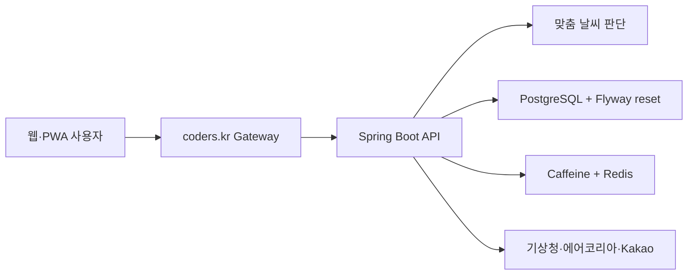

<p align="center">
  <a href="https://weather.coders.kr">
    
  </a>
</p>

<h1 align="center">날씨한편</h1>

<p align="center">
  내 위치의 <strong>시간별 날씨·강수·대기질·기상특보</strong>를 한눈에 보고<br>
  지금 무엇을 준비할지 바로 결정하는 생활 날씨 서비스
</p>

<p align="center">
  <a href="https://weather.coders.kr"></a>
  
  
</p>

## 바로 사용하기

**운영 서비스:** [https://weather.coders.kr](https://weather.coders.kr)

1. 동네, 역 또는 건물명을 검색합니다.
2. 오늘·내일·모레와 시간별 날씨, 준비물을 확인합니다.
3. 활동 목적과 체감 성향을 바꿔 나에게 맞는 외출 판단을 확인합니다.

> 기상청·에어코리아 원천자료를 활용한 독립 서비스입니다. 기상청 공식 홈페이지나 인증·납품 제품을 의미하지 않습니다.

## 이런 분께 유용합니다

- 출근 전에 우산·겉옷·마스크를 한 번에 결정하고 싶은 분
- 추위나 더위를 많이 타서 일반적인 옷차림 추천이 맞지 않는 분
- 산책·야외 활동·격식 일정에 따라 다른 준비가 필요한 분
- 미세먼지·자외선·꽃가루와 기상특보를 함께 확인하고 싶은 분

## 이 서비스가 알려주는 것

| 사용자의 질문 | 날씨한편의 답 |
| --- | --- |
| 지금 실제로 비가 오거나 덥나? | 최신 관측 기온·체감온도·강수·습도·바람 |
| 앞으로 날씨가 어떻게 변할까? | 오늘부터 모레까지 시간별 기온과 강수 흐름 |
| 비는 언제 시작하고 끝날까? | 비·눈 가능성이 높은 첫 시간과 마지막 시간 |
| 공기와 생활안전은 괜찮을까? | 미세먼지·초미세먼지·자외선·꽃가루·특보 |
| 오늘과 내일 중 언제가 좋을까? | 3일 예보와 아침·점심·저녁 비교 |
| 무엇을 준비해야 할까? | 우산·마스크·야외 활동·맞춤 코디 추천 |
| 왜 이 점수일까? | 위험 요인별 감점, 실제 근거 수치, 지금 할 일 |
| 어떤 근거로 판단했나? | 위험 요인별 실제 수치와 대응 행동 |

## 주요 기능

### 현재·시간별·3일 날씨

- 동네·역·건물 검색과 현재 위치
- 예보와 구분된 최신 기온·체감온도·강수 관측
- 오늘부터 모레까지 시간별 기온·강수·습도·바람
- 강수 시작·종료 예상과 일 최저·최고기온
- 아침·점심·저녁 비교와 날씨 테마 자동 전환
- 기상청 발표·수집시각과 자료 상태 표시

### 설명 가능한 사용자 맞춤 판단

- 일상·출근·야외 활동·격식 일정에 맞춘 위험 판단
- 보통·추위 민감·더위 민감 성향에 따른 개인 체감온도
- 강수·기온·풍속·습도·대기질·자외선·꽃가루·특보 감점 공개
- 각 위험의 실제 수치와 지금 할 일 제공
- 영향도가 큰 순서로 보여줘 추천 이유를 직접 확인

### 공기질과 생활안전

- 에어코리아 PM10·PM2.5, 등급, 측정소
- 지역별 공식 기상특보
- 자외선지수와 계절성 꽃가루 위험
- 부가 정보가 지연돼도 가능한 기본 날씨는 계속 제공

### 나에게 맞는 옷차림

- 상의·하의·아우터·신발·추천 색상까지 조합
- 비·눈·바람·습도에 맞는 소재와 피해야 할 옷 안내
- 체감 성향과 활동 목적을 바꾸면 추천을 즉시 다시 계산

### 일정과 이동 도구

- 출발지와 목적지의 날씨·이동시간 비교
- 희망 일정 주변에서 비·바람이 덜한 출발 시간 제안
- 추천 시간을 캘린더 파일로 저장
- 홈 화면 설치와 오프라인 상태 안내

## 데이터와 이용 안내

| 제공기관 | 사용 정보 |
| --- | --- |
| 기상청 | 단기예보, 현재 관측, 기상특보, 자외선, 꽃가루 |
| 한국환경공단 에어코리아 | PM10·PM2.5와 측정소 |
| Kakao | 장소 검색과 이동 경로 |

- 예보의 발표·수집시각과 자료 상태를 함께 표시합니다.
- 위험한 상황에서는 서비스 추천보다 기상청 공식 특보와 안전지침을 우선하세요.

운영 전환 과정에서 기존 이메일 구독 데이터와 발송 이력은 Flyway `V3` 마이그레이션으로 비우며,
현재 서비스는 이메일·로그인 없이 날씨 조회에 집중합니다. 위치·설정은 브라우저에만 저장됩니다.

## 기술 구성

사용자 기능 아래에는 실제 운영을 위한 기술 구성이 함께 구현되어 있습니다.

| 영역 | 기술 |
| --- | --- |
| Backend | Java 17, Spring Boot 3.5.16, Spring Web, Validation |
| UI | Thymeleaf, HTML, CSS, Vanilla JavaScript, PWA |
| Database | PostgreSQL + Flyway(전환 데이터 정리), H2 로컬 · MySQL 선택 지원 |
| Cache | Caffeine, Redis |
| Concurrency | 요청 기반 bounded executor · provider별 격리 |
| External API | 기상청, 에어코리아, Kakao, Apache HttpClient |
| Observability | Actuator, Prometheus, request ID |
| Quality | JUnit 5, AssertJ, GitHub Actions, Dependabot, CycloneDX SBOM |



## 운영 안정성과 보안

- 외부 API 연결·응답 timeout, 제한된 재시도, 공급자별 circuit breaker
- 최근 정상자료 fallback과 출처·발표시각·수집시각·자료 상태 표시
- HTTP connection pool, bounded cache/executor와 read·write 요청 제한
- Redis 분산 제어와 bounded executor로 다중 인스턴스 요청 폭주 완화
- CSP nonce, HSTS, 외부 입력 검증과 운영 환경 fail-closed 설정
- request ID, Actuator, Prometheus, readiness/liveness probe
- 전체 테스트·실행 JAR·Docker build·dependency review·SBOM을 CI에서 검증

## 개발과 문서

```powershell
.\gradlew.bat clean test bootJar --no-daemon
.\gradlew.bat bootRun
```

실제 API 키는 저장소에 커밋하지 않고 환경변수로 주입합니다. 설정 항목은 [.env.example](.env.example)을 참고하세요.

[API 계약](docs/API_CONTRACT.md) · [운영 런북](docs/OPERATIONS.md) · [개인정보 설계](docs/PRIVACY.md) · [제품 로드맵](docs/PRODUCT_ROADMAP.md) · [보안 정책](SECURITY.md) · [기여 방법](CONTRIBUTING.md)

---

**날씨한편은 날씨 정보가 중심이고, 추천 기능은 그 정보를 이해하고 활용하도록 돕습니다.**
