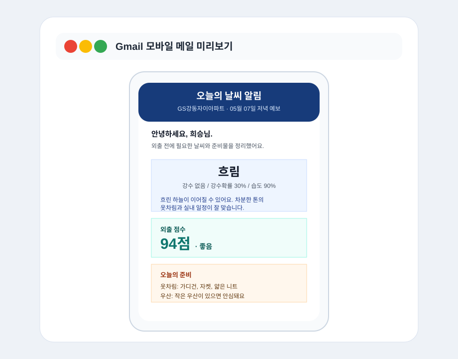
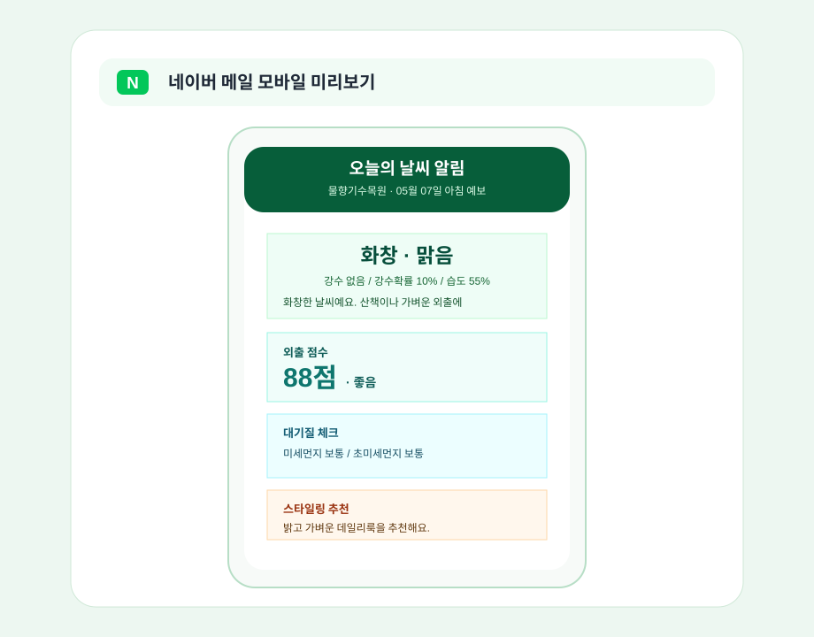
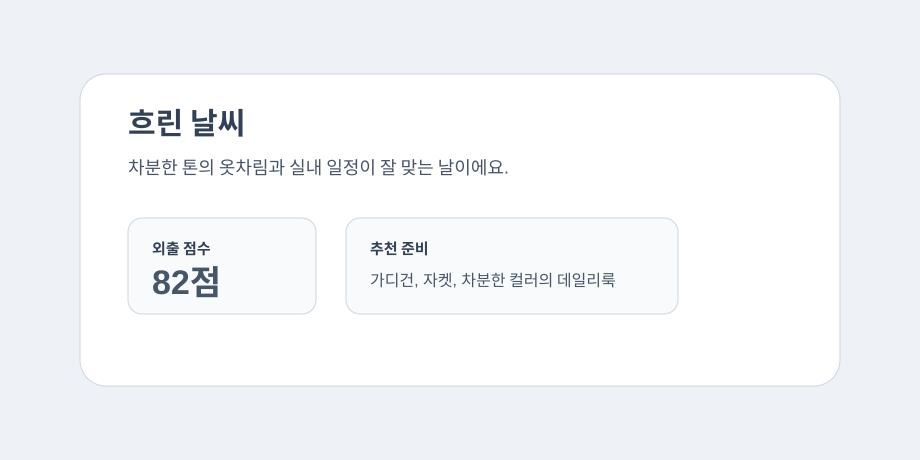
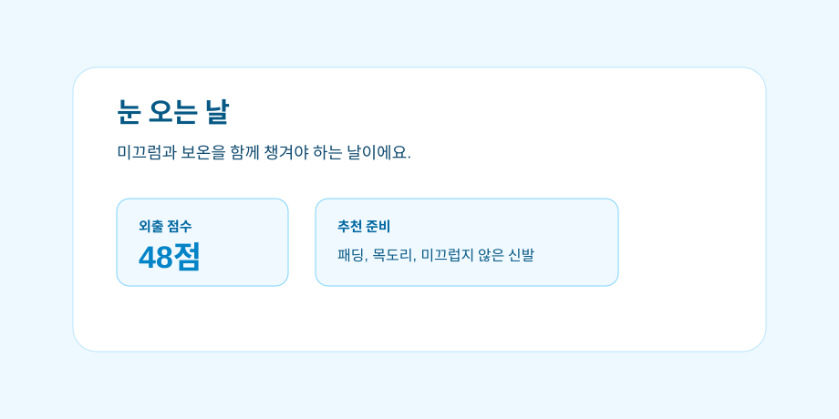
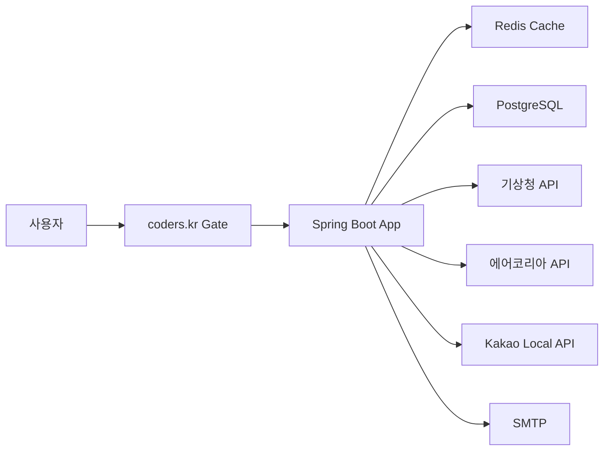

# 날씨한편 — 위치 기반 날씨 메일 서비스

사용자가 원하는 지역과 알림 시간을 선택하면, 기상청 단기예보와 에어코리아 대기질 데이터를 기반으로 날씨 메일을 자동 발송하는 Spring Boot 서비스입니다. coders.kr의 native identity, 관리형 PostgreSQL·Redis, scale-to-zero 배포 계약에 맞춰 실제 운영 가능한 구조로 구성했습니다.

단순히 기온만 전달하지 않고, 외출 점수, 날씨별 상세 조언, 미세먼지/마스크 안내, 우산 여부, 연령대/성별 기반 스타일링 추천까지 제공하는 생활 밀착형 날씨 구독 서비스입니다.

## 미리보기

사용자는 위치, 알림 시간, 연령대, 성별을 선택해 구독합니다. 위치를 선택하면 현재 예보를 바탕으로 화면 분위기가 맑음/비/눈/흐림 상태에 맞게 바뀌고, 외출 점수와 상세 조언을 바로 확인할 수 있습니다.


메일에서는 날씨 요약, 외출 점수, 미세먼지, 옷차림, 우산, 마스크, 스타일링 추천을 모바일 친화적인 단일 컬럼 레이아웃으로 제공합니다. Gmail과 네이버 메일에서 보이는 화면을 기준으로 메일 폭, 카드 간격, 텍스트 줄바꿈을 조정했습니다.

### Gmail / Naver Mail

| Gmail 모바일 | 네이버 메일 모바일 |
| --- | --- |
|  |  |

### 날씨별 화면 테마

날씨에 따라 프론트 화면과 메일의 상세 문구가 달라집니다. 맑은 날은 화창하고 밝게, 비 오는 날은 우산과 방수 신발을 강조하는 식으로 사용자에게 바로 필요한 준비를 안내합니다.

| 맑음 | 비 |
| --- | --- |
|  |  |

| 흐림 | 눈 |
| --- | --- |
|  |  |

## 주요 기능

- 지역명 검색 또는 브라우저 현재 위치 기반 위치 선택
- Kakao Local API를 통한 주소/장소 검색
- 위도/경도 좌표를 기상청 격자 좌표로 변환
- 기상청 단기예보 API 연동
- 한국환경공단 에어코리아 미세먼지 API 연동
- 위치 선택 시 아침·점심·저녁 시간대별 날씨 미리보기 제공
- 날씨 상태별 화면 테마 변경
  - 맑음: 밝고 화창한 분위기
  - 비: 차분한 비 오는 날 분위기
  - 눈: 차가운 겨울 분위기
  - 흐림: muted한 흐린 날 분위기
- 외출 점수 산정
  - 강수, 기온, 습도, 풍속, 미세먼지 조건을 반영
  - 좋음/무난/주의/나쁨 상태 제공
- 날씨별 상세 조언
  - 비 오는 날 우산/방수 신발 안내
  - 맑은 날 산책/가벼운 옷차림 안내
  - 흐린 날 실내 일정/차분한 스타일 안내
  - 눈 오는 날 미끄럼/보온 안내
- 연령대/성별 기반 스타일링 추천
- 미세먼지/초미세먼지 상태에 따른 마스크 추천
- 구독 등록 시 웰컴 날씨 메일 즉시 발송
- 아침/점심/저녁 알림 시간 선택
- 로그인 계정의 현재 구독 조회·알림 시간 변경·안전한 구독 해지
- 스케줄러를 통한 시간대별 자동 발송
- 전체 구독자 수동 발송 API
- 특정 사용자 대상 지정 발표시각 테스트 발송 API
- 선택적 관리자 키 기반 운영 API 보호
- 메일 발송 성공/실패 이력 저장
- 최근 발송 이력 조회 API
- 구독 위치 변경 API
- 스타일 추천 기준 변경 API
- 토큰 기반 이메일 수신 거부
- Gmail/네이버 메일을 고려한 모바일 친화 HTML 메일 템플릿
- `null` 값 대신 `-` 또는 안내 문구 표시
- coders.kr 로그인 사용자와 구독 정보 소유권 연결
- Redis 기반 분산 날씨·위치 캐시
- 외부 API HTTP 연결 풀과 연결·응답 타임아웃
- 여러 인스턴스의 예약 메일 중복 발송을 막는 분산 스케줄 락
- bounded 메일 executor와 큐 포화 시 backpressure
- 관리자 API fail-closed 보호 및 보안 응답 헤더
- API 오류 코드·요청 ID 기반 사용자 문의와 서버 로그 추적
- Actuator health probe, graceful shutdown, 응답 압축
- GitHub Actions 테스트·컨테이너 빌드 및 Dependabot

## 기술 스택

- Java 17
- Spring Boot 3.2.5
- Spring Web
- Spring Data JPA
- Spring Mail
- Spring Scheduler
- Thymeleaf
- MySQL
- PostgreSQL
- Redis / Caffeine Cache
- Apache HttpClient 5
- ShedLock
- Spring Boot Actuator
- Lombok
- org.json
- Kakao Local API
- 기상청 단기예보 API
- 에어코리아 대기오염정보 API

## 운영 아키텍처



- 공개 `GET` 요청은 coders.kr의 익명 quota 안에서 제공됩니다.
- 구독·변경 요청은 native gate가 로그인을 요구하고 `X-Coders-User`를 전달합니다.
- 앱은 전달받은 사용자 ID와 구독 정보를 연결해 다른 사용자의 설정 변경을 막습니다.
- 날씨는 10분, 위치 검색은 1시간 Redis에 캐시해 외부 API와 pod 부하를 줄입니다.
- 스케줄 작업은 DB 분산 락으로 보호돼 여러 인스턴스에서도 한 번만 실행됩니다.

## 프로젝트 구조

```text
Dockerfile
coders.yaml
.github/
├── workflows/ci.yml
└── dependabot.yml

src/main/java/com/example/WebSideProject
├── config
│   ├── AppConfig.java
│   ├── CacheConfig.java
│   ├── ProdCacheConfig.java
│   ├── SchedulerLockConfig.java
│   └── SecurityHeadersFilter.java
├── controller
│   ├── HomeController.java
│   ├── LocationController.java
│   ├── UserController.java
│   ├── WeatherController.java
│   └── WeatherMailController.java
├── dto
│   ├── LocationDto.java
│   ├── UserDto.java
│   ├── WeatherDto.java
│   └── WeatherMailHistoryDto.java
├── entity
│   ├── User.java
│   └── WeatherMailHistory.java
├── repository
│   ├── UserRepository.java
│   └── WeatherMailHistoryRepository.java
├── scheduler
│   └── WeatherMailScheduler.java
└── service
    ├── LocationService.java
    ├── MailService.java
    ├── UserService.java
    ├── WeatherMailHistoryService.java
    └── WeatherService.java
```

## API

### 위치 검색

```http
GET /api/locations/search?query=강남역
```

Kakao Local API로 장소 또는 주소를 검색하고, 기상청 격자 좌표까지 변환해 반환합니다.

```json
[
  {
    "locationName": "강남역",
    "latitude": 37.4979,
    "longitude": 127.0276,
    "nx": 61,
    "ny": 125
  }
]
```

브라우저 위치 권한을 허용하면 위도·경도를 기상청 격자로 변환해 즉시 선택합니다. 대한민국 범위를 벗어난 좌표는 거부합니다.

```http
GET /api/locations/coordinates?latitude=37.5665&longitude=126.9780
```

### 날씨 조회

```http
GET /api/weather?nx=61&ny=125&period=MORNING&locationName=강남역
```

기상청 단기예보와 에어코리아 미세먼지 정보를 함께 반환합니다. 응답에는 외출 점수, 날씨 테마, 상세 날씨 조언, 미세먼지 표시값 등이 포함됩니다.

```json
{
  "forecastLabel": "05월 07일 아침 예보",
  "skyDescription": "흐림",
  "weatherMood": "흐림",
  "weatherTheme": "cloudy",
  "detailedWeatherMessage": "흐린 하늘이 이어질 수 있어요. 차분한 톤의 옷차림과 실내 일정이 잘 맞습니다.",
  "outingScore": 94,
  "outingScoreLabel": "좋음",
  "weatherConditionLine": "강수 없음 / 강수확률 30% / 습도 90%",
  "pm10Display": "-",
  "pm25Display": "-"
}
```

### 구독 등록

```http
POST /api/users/subscribe
Content-Type: application/json
```

```json
{
  "name": "홍길동",
  "email": "user@example.com",
  "locationName": "강남역",
  "latitude": 37.4979,
  "longitude": 127.0276,
  "nx": 61,
  "ny": 125,
  "ageGroup": "TWENTIES",
  "gender": "FEMALE",
  "morningEnabled": true,
  "afternoonEnabled": false,
  "eveningEnabled": true
}
```

### 수신 거부

메일에 포함된 수신 거부 링크는 사용자별 토큰을 사용합니다.

```http
GET /api/users/unsubscribe?token={unsubscribeToken}
```

이메일 주소만으로 실행되는 공개 수신 거부는 지원하지 않습니다. 설정 변경 API는 coders.kr 로그인 사용자와 구독 소유권을 확인합니다.

```http
PATCH /api/users/unsubscribe?email=user@example.com
```

`X-Coders-User`는 클라이언트가 만들지 않으며 coders.kr gate가 검증 후 자동으로 주입합니다.

### 내 구독 관리

coders.kr 로그인 계정에 연결된 구독은 이메일 주소를 다시 입력하지 않고 조회·변경·해지할 수 있습니다.

```http
GET /api/users/me
PATCH /api/users/me/notifications
DELETE /api/users/me/subscription
```

알림 시간 변경 요청:

```json
{
  "morningEnabled": true,
  "afternoonEnabled": true,
  "eveningEnabled": false
}
```

모든 시간을 끄면 메일이 완전히 사라지는 실수를 방지하기 위해 아침 알림이 자동으로 유지됩니다.

### 재구독

```http
PATCH /api/users/resubscribe?email=user@example.com
```

### 스타일 추천 기준 변경

이미 구독한 이메일의 연령대와 성별 선택값을 변경합니다.

```http
PATCH /api/users/style-preference
Content-Type: application/json
```

```json
{
  "email": "user@example.com",
  "ageGroup": "THIRTIES",
  "gender": "MALE"
}
```

사용 가능한 값은 다음과 같습니다.

```text
ageGroup: NONE, TEENS, TWENTIES, THIRTIES, FORTIES, FIFTIES_PLUS
gender: NONE, FEMALE, MALE
```

### 구독 위치 변경

이미 구독한 이메일의 지역 정보를 새 위치로 변경합니다.

```http
PATCH /api/users/location
Content-Type: application/json
```

```json
{
  "email": "user@example.com",
  "locationName": "강남역",
  "latitude": 37.4979,
  "longitude": 127.0276,
  "nx": 61,
  "ny": 125
}
```

### 메일 수동 발송

특정 시간대만 발송합니다.

```http
POST /api/weather-mails/send-now?period=MORNING
POST /api/weather-mails/send-now?period=AFTERNOON
POST /api/weather-mails/send-now?period=EVENING
```

`ADMIN_API_KEY`를 설정한 환경에서는 운영성 API 호출 시 `X-Admin-Key` 헤더가 필요합니다.

```http
X-Admin-Key: your_optional_admin_key
```

아침/점심/저녁 전체 시간대 발송을 한 번에 실행할 수도 있습니다. 이 기능은 테스트 및 운영 확인용입니다.

```http
POST /api/weather-mails/send-all
```

특정 구독자 1명에게 기상청 발표시각을 직접 지정해 테스트 메일을 보낼 수 있습니다.

```http
POST /api/weather-mails/send-test?email=user@example.com&period=EVENING&baseDate=20260504&baseTime=1700
```

메일 없이 날씨 데이터만 확인하고 싶다면 아래 API를 사용합니다.

```http
GET /api/weather/test?nx=61&ny=125&period=EVENING&locationName=강남역&baseDate=20260504&baseTime=1700
```

### 메일 발송 이력 조회

최근 메일 발송 성공/실패 이력을 조회합니다.

```http
GET /api/weather-mails/histories
GET /api/weather-mails/histories?email=user@example.com
```

```json
[
  {
    "id": 45,
    "userEmail": "user@example.com",
    "locationName": "강남역",
    "period": "MORNING",
    "status": "SUCCESS",
    "forecastDate": "20260507",
    "forecastTime": "0900",
    "errorMessage": null,
    "sentAt": "2026-05-07T20:10:00"
  }
]
```

## 메일 구성

메일은 Gmail과 네이버 메일 모바일 화면을 고려해 단일 컬럼 테이블 레이아웃으로 구성했습니다.

- 오늘의 날씨 알림
- 현재 날씨 요약
- 날씨별 상세 조언
- 외출 점수
- 대기질 체크
- 옷차림/우산/마스크 준비
- 연령대/성별 기반 스타일링 추천
- 토큰 기반 수신 거부 링크

데이터가 없거나 외부 API 호출에 실패한 항목은 `null`을 노출하지 않고 `-` 또는 안내 문구로 표시합니다.

API 요청이 실패하면 내부 예외나 비밀번호 같은 민감한 정보는 숨기고, 사용자가 이해할 수 있는 메시지와 추적용 문의 코드를 반환합니다.

```json
{
  "code": "DATABASE_UNAVAILABLE",
  "message": "데이터베이스 연결이 원활하지 않습니다. 잠시 후 다시 시도해주세요.",
  "requestId": "a1b2c3d4"
}
```

화면에도 문의 코드가 함께 표시되므로 운영 로그의 `requestId`로 동일한 오류를 빠르게 찾을 수 있습니다.

## 환경 변수

실제 키와 비밀번호는 GitHub에 올리지 않고 환경변수로 관리합니다.

```env
DB_URL=jdbc:mysql://localhost:3306/weatherdb?useSSL=false&serverTimezone=Asia/Seoul&characterEncoding=UTF-8&allowPublicKeyRetrieval=true
DB_USERNAME=root
DB_PASSWORD=your_mysql_password

SMTP_HOST=smtp.gmail.com
SMTP_PORT=587
SMTP_USERNAME=your_email@gmail.com
SMTP_PASSWORD=your_gmail_app_password

WEATHER_API_KEY=your_kma_api_key
WEATHER_API_BASE_URL=https://apis.data.go.kr/1360000/VilageFcstInfoService_2.0

AIR_QUALITY_API_KEY=your_airkorea_api_key
AIR_QUALITY_API_BASE_URL=https://apis.data.go.kr/B552584/ArpltnInforInqireSvc

KAKAO_REST_API_KEY=your_kakao_rest_api_key
APP_BASE_URL=http://localhost:8080
ADMIN_API_KEY=your_optional_admin_key
```

`AIR_QUALITY_API_KEY`는 기상청 날씨 키와 별개의 에어코리아 키입니다. 아직 키를 발급받지 않았다면 비워둘 수 있으며, 이 경우 날씨 서비스는 정상 동작하고 대기질 조회만 건너뜁니다.

운영 환경에서는 `ADMIN_API_KEY`가 비어 있으면 관리자 API가 자동으로 비활성화됩니다. 키는 저장소나 `coders.yaml`에 넣지 말고 배포 플랫폼의 secret 환경변수로 설정해야 합니다.

## coders.kr 배포

이 저장소의 `coders.yaml`은 [coders.kr 공식 `llms.txt`](https://coders.kr/llms.txt)와 템플릿의 `PLATFORM.md` 계약에 맞춰 작성했습니다.

- `mode: native`
- Spring Boot 단일 public 서비스
- 관리형 PostgreSQL과 Redis
- 이미지 빌드 단계에서 Gradle 의존성과 실행 JAR 생성
- 런타임 설치 작업 없이 빠른 cold start
- 플랫폼이 주입하는 `PORT`로 서버 실행

배포 전 아래 값을 coders.kr secret 환경변수로 등록해야 합니다.

```text
WEATHER_API_KEY
AIR_QUALITY_API_KEY
KAKAO_REST_API_KEY
SMTP_USERNAME
SMTP_PASSWORD
ADMIN_API_KEY
APP_BASE_URL=https://<배포이름>.coders.kr
```

처음 배포할 때는 `coders.kr/llms.txt`의 Path A 인증 후 이 GitHub 저장소와 프로젝트 이름을 전달합니다. 실제 API 키와 SMTP 비밀번호는 GitHub에 커밋하지 않습니다.

> coders.kr는 유휴 서비스를 scale-to-zero로 전환합니다. 오전 06:30, 11:30, 18:30 예약 메일을 정확하게 발송하려면 배포 후 프로젝트 정책에서 `always_warm`을 활성화하고 사이트 예산을 충전해야 합니다. 사용하지 않으면 웹 요청이 없어 pod가 내려간 시간의 스케줄은 실행되지 않을 수 있습니다.

공식 계약상 장시간 SSE/long-poll은 quota를 빠르게 사용하므로 이 프로젝트는 짧은 HTTP 요청만 사용합니다. 외부 API 응답은 Redis에 캐시해 익명 quota와 공공 API 호출량을 함께 절약합니다.

## 로컬 실행

로컬 개발은 MySQL을 사용하고, `prod` 프로필은 coders.kr가 제공하는 PostgreSQL을 사용합니다. Hibernate 방언은 접속한 DB에 맞춰 선택되므로 MySQL 전용 DDL이 PostgreSQL에 실행되지 않습니다.

MySQL에 `weatherdb` 데이터베이스를 만든 뒤 실행합니다.

```sql
CREATE DATABASE weatherdb DEFAULT CHARACTER SET utf8mb4 COLLATE utf8mb4_unicode_ci;
```

로컬 개발에서는 `src/main/resources/application-local.yml`을 사용할 수 있습니다. 이 파일은 `.gitignore`에 포함되어 GitHub에는 올라가지 않으며, IntelliJ에서 바로 실행할 때 개인 DB 비밀번호, SMTP 비밀번호, API 키를 보관하는 용도입니다.

```bash
./gradlew bootRun
```

Windows PowerShell 예시:

```powershell
$env:DB_PASSWORD="your_mysql_password"
$env:SMTP_USERNAME="your_email@gmail.com"
$env:SMTP_PASSWORD="your_gmail_app_password"
$env:WEATHER_API_KEY="your_kma_api_key"
$env:KAKAO_REST_API_KEY="your_kakao_rest_api_key"
.\gradlew.bat bootRun
```

## 테스트 발송

서버 실행 후 전체 구독자에게 아침/점심/저녁 메일을 테스트 발송할 수 있습니다.

```http
POST http://localhost:8080/api/weather-mails/send-all
```

발송 결과는 아래 API에서 확인합니다.

```http
GET http://localhost:8080/api/weather-mails/histories
```

## 추가 개선 예정

- 관리자 대시보드
- 수신 거부 완료 HTML 페이지
- 사용자별 분 단위 직접 발송 시간
- 기상특보·비·눈·미세먼지 위험 조건 즉시 알림
- 주간 예보와 캘린더 일정 기반 외출 추천
- 메일 미리보기와 템플릿 A/B 테스트
- Flyway 기반 명시적 DB 마이그레이션
